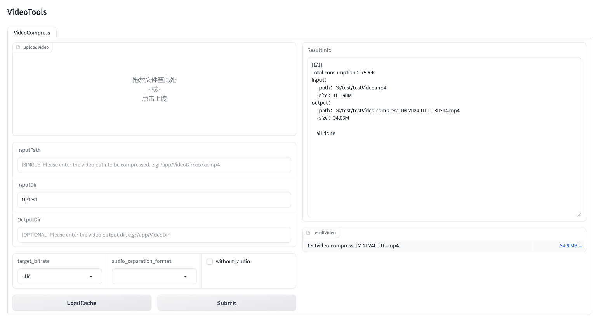

## Gradio UI of video-compress 

### running in docker mode

[click here to see docker instructions](../docker/gradio/README.md)


### local source code running

- install dependencies
```shell
pip install -r requirements.txt
pip install -r gradio_ui/requirements.txt
```

- Run (directly run the `gradio_ui/app.py`, or :)
```shell
uvicorn gradio_ui.app:app --host 0.0.0.0 --port 7860
```


